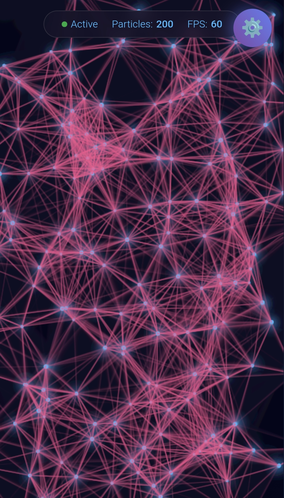

# Particle Playground

An interactive particle system with beautiful graphics, mouse interaction, and persistent state storage.



## Demo

**Live Demo:** [https://particleplayground.github.io](https://particleplayground.github.io)

## Features

### Particle Controls
- **Particle Count** - Adjust from 50 to 1000 particles
- **Particle Size** - Scale particles from tiny to large
- **Speed** - Control movement velocity
- **Mouse Radius** - Set interaction area size
- **Connection Distance** - Adjust line connection range
- **Trail Length** - Create motion blur effects

### Visual Effects
- **Primary/Secondary Colors** - Full color customization
- **Background Color** - Dark theme customization
- **Blend Modes** - Normal, Lighter (Glow), Screen, Overlay
- **Glow Effect** - Toggle particle glow
- **Rainbow Mode** - Animated color cycling
- **Pulse Animation** - Breathing particle effect

### Mouse Effects
- **Attract** - Particles drawn to cursor
- **Repel** - Particles pushed away
- **Orbit** - Particles circle around cursor
- **Explode** - Burst effect on close proximity
- **Vortex** - Spiral attraction pattern

### Particle Shapes
- Circle
- Square
- Triangle
- Star
- Heart

### Presets
| Preset | Description |
|--------|-------------|
| 🌌 Galaxy | Purple cosmic theme with orbiting particles |
| 🔥 Fire | Orange/red flames with repel effect |
| 🌊 Ocean | Blue water effect with vortex |
| 💫 Neon | Colorful rainbow with glow |
| ❄️ Snow | White winter particles |
| 💚 Matrix | Green digital rain effect |

### State Management
- Auto-saves to localStorage
- Restores on page reload
- Export configuration as JSON
- Random generator
- Reset to defaults

### Responsive Design
- Landscape mode - Controls panel on right side
- Portrait mode - Controls panel at bottom
- Touch support for mobile devices
- Orientation change handling

## Usage

### Basic Interaction
1. Move your mouse or touch the screen to interact with particles
2. Particles respond based on the selected mouse effect
3. Adjust controls to customize the experience

### Saving Your Configuration
1. Click **💾 Save** to store current settings
2. Click **📤 Export** to download configuration as JSON
3. Settings automatically restore on page reload

### Quick Start with Presets
1. Open the controls panel
2. Scroll to the Presets section
3. Click any preset button to instantly apply a theme

## Installation

### Option 1: Direct Use
Simply visit [https://particleplayground.github.io](https://particleplayground.github.io)

### Option 2: Local Setup
```bash
git clone https://github.com/particleplayground/particleplayground.github.io.git
cd particleplayground.github.io
```

Open `index.html` in your browser.

### Option 3: Self-Hosting
1. Download the repository
2. Upload `index.html` to your web server
3. No build process or dependencies required

## Configuration Options

| Option | Type | Range | Default |
|--------|------|-------|---------|
| particleCount | number | 50-1000 | 200 |
| particleSize | number | 1-15 | 3 |
| speed | number | 0.5-10 | 2 |
| mouseRadius | number | 50-400 | 150 |
| connectionDist | number | 50-250 | 120 |
| trailLength | number | 0.01-1 | 0.1 |
| primaryColor | hex | - | #64b5f6 |
| secondaryColor | hex | - | #f06292 |
| bgColor | hex | - | #0a0a1a |
| mouseEffect | string | attract/repel/orbit/explode/vortex | attract |
| particleShape | string | circle/square/triangle/star/heart | circle |
| blendMode | string | source-over/lighter/screen/overlay | source-over |
| showConnections | boolean | - | true |
| rainbow | boolean | - | false |
| glow | boolean | - | true |
| pulse | boolean | - | false |

## Exported JSON Structure
```json
{
  "particleCount": 200,
  "particleSize": 3,
  "speed": 2,
  "mouseRadius": 150,
  "connectionDist": 120,
  "trailLength": 0.1,
  "primaryColor": "#64b5f6",
  "secondaryColor": "#f06292",
  "bgColor": "#0a0a1a",
  "mouseEffect": "attract",
  "particleShape": "circle",
  "blendMode": "source-over",
  "showConnections": true,
  "rainbow": false,
  "glow": true,
  "pulse": false
}
```

## Performance Tips

- Reduce particle count on lower-end devices
- Disable connections for better performance
- Use simpler shapes (circle, square) for smoother animation
- Reduce connection distance to minimize calculations
- Disable glow effect on mobile devices

## Contributing

1. Fork the repository
2. Create your feature branch (`git checkout -b feature/amazing-feature`)
3. Commit your changes (`git commit -m 'Add amazing feature'`)
4. Push to the branch (`git push origin feature/amazing-feature`)
5. Open a Pull Request

## License

MIT

---

Made with ✨ and particles
